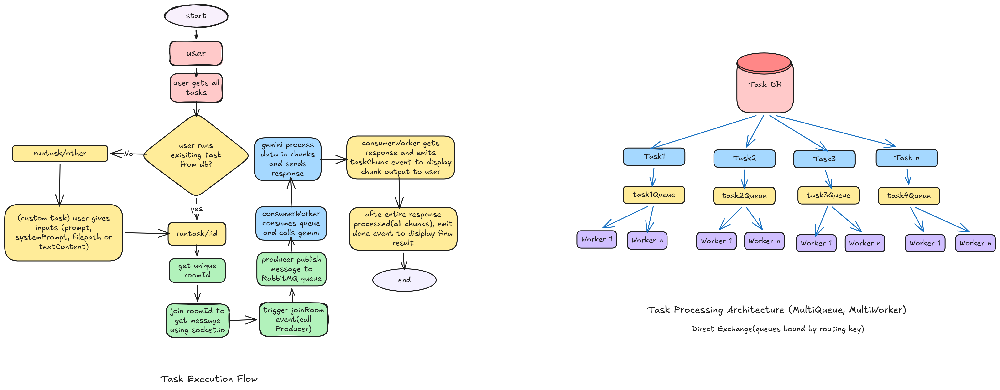

Distributed AI Document Processing system

How it Started? (General Idea about the project)

I didn't come across this topic for the project directly. I only wanted to integrate Gemini with api calls. So I choose Document processing as the main domain.

I realised that if multiple users sent the requests at the same time, it would lead to longer response times and degrade the performance.

So I setup RabbitMQ to process the requests in background.

Now number of requests in rabbitMQ queue might vary, more for a particular task and less for some. So instead of manually starting new Workers, I created a worker manager who tracks the queue size every 10 seconds and scales accordingly.

Then I faced a problem, I was getting the gemini response but how to show it to the user, as request response cycle would time-out by the time gemini processed the request. To solve this I Integrated Socket.io for real time communication.

Architecture or Thought Process:

DB schema:

Users:
    id
    name
    email
    password
    role

Task:
    id
    taskName
    description
    prompt
    systemPrompt
    examples
    queueName
    routingKey
       
        

## API(10)

---

#### Auth Endpoints:

1. Signup(user/admin)
2. Login(user/admin)

#### Task  endpoints:
3. Get all Tasks(user/admin)

#### User action endpoints:

4. run task(user)
5. update user profile(user)

#### Admin action endpoints:

6. Get all Users (admin)
7. Delete users (admin)
8. create new task (admin)
9. Delete task by id (admin)
10. Update Task (admin)

Main Design Process:

1) Admin can create new tasks and add to db(with details like prompt,system prompt,examples)
2) Users can either choose out of existing tasks or send a custom task(still working on custom task logic)
3) For exisitng tasks user sends textContent(if processing text) or filePath ( for pdf,image,docx)
4) User should have minimal interaction and only provide essential inputs so mimetype field and type of data is auto set based on file path extension. (mimetype is later needed for gemini api call)

Challenges I Faced:
1) First problem I faced was setting up rabbitMQ,

 I faced an error called property doesnt exist for createChannel method. So i went through stack overflow solutions and official documentation, i got a suggestion of downgrading amqp version to 10.5 but it still didnt work. I could't find other suggestions to solve it.

 so used ai for this, it told me to install amqp with @latest and it somehow got fixed. 

 2) Second challenge i faced was thinking about all the fields in request body and how it will work together with mutiple data formats and gemini. For this I have used gemini file api for handling different file formats. as Gemini API accepts file size greater than 100mb. So its more efficient.

 3) Third challenge i faced was when i got the gemini response, I coudln't figure out how to send it to user in backend as api call follows a request response cycle. Till the time gemini response is received api call times out,  so to solve this problem , i used websockets

 4) Another issue I faced was in logic of websockets, what i was doing was
  user runs a task-> gets roomId-> joins room to get gemini response. But it wasn't happening parallely. 

  By the time user joined, message was already lost. So to fix this i made a seperate function and triggered a joinroom event after user joins the room. So gemini api call is made only after user joins the room and message isn't lost.

  5) Last problem was managing the workers. Instead of managing workers manually, I created a workerManger. Based on specific threshold of min and max worker, it scales worker by counting number of messages in the queue for a given task.

